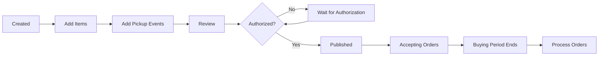

## Overview

Fundraisers are campaigns run by your organization to sell items and raise money. Each fundraiser has a defined buying period, pickup events, and associated items.

<Note>
  Fundraisers must belong to an authorized organization to be published and accept orders.
</Note>

## Creating a Fundraiser

<Steps>
  <Step title="Navigate to Create Fundraiser">
    From your organization page at `/seller/org/:organizationId`, click "Create Fundraiser" to navigate to `/seller/org/:id/create-fundraiser`.
  </Step>
  
  <Step title="Set Basic Information">
    <ParamField path="name" type="string" required>
      Fundraiser name (1-255 characters)
      
      ```typescript
      z.string().min(1).max(255)
      ```
    </ParamField>
    
    <ParamField path="description" type="string" required>
      Detailed description of your fundraiser's purpose and goals
    </ParamField>
    
    <ParamField path="goalAmount" type="Decimal">
      Target profit amount for the fundraiser (stored as `@db.Money`)
      
      ```typescript
      MoneySchema.optional() // Decimal with 2 decimal places
      ```
    </ParamField>
    
    <Info>
      The goal amount is used for tracking progress in analytics. The platform assumes a 20% profit margin for calculations.
    </Info>
  </Step>
  
  <Step title="Define Buying Period">
    Set when customers can place orders:
    
    <ParamField path="buyingStartsAt" type="DateTime" required>
      Start date and time for accepting orders
      
      ```typescript
      z.coerce.date()
      ```
    </ParamField>
    
    <ParamField path="buyingEndsAt" type="DateTime" required>
      End date and time for accepting orders
      
      ```typescript
      z.coerce.date()
      ```
    </ParamField>
    
    <Warning>
      Customers cannot place orders outside the buying period, even if the fundraiser is published.
    </Warning>
  </Step>
  
  <Step title="Upload Fundraiser Images">
    <ParamField path="imageUrls" type="string[]" required>
      Array of image URLs to display on the fundraiser page
      
      ```typescript
      z.array(z.string().url())
      ```
    </ParamField>
    
    Add multiple images to showcase your fundraiser and the items being sold.
  </Step>
  
  <Step title="Add Payment Information">
    Configure how you'll receive payments:
    
    <ParamField path="venmoUsername" type="string">
      Venmo username for receiving payments (5-30 characters)
      
      ```typescript
      z.string().min(5).max(30).optional()
      ```
    </ParamField>
    
    <ParamField path="venmoEmail" type="string">
      Email address associated with Venmo account
      
      ```typescript
      z.string().email().optional()
      ```
    </ParamField>
    
    <Info>
      At least one payment method (Venmo username or email) is recommended. Customers can also select "OTHER" payment methods.
    </Info>
  </Step>
  
  <Step title="Create Pickup Events">
    Add at least one pickup event where customers can collect their orders:
    
    <ParamField path="pickupEvents" type="PickupEvent[]" required>
      Array of pickup event objects (minimum 1 required)
      
      ```typescript
      z.array(CreatePickupEventBody).min(1)
      ```
    </ParamField>
    
    ### Pickup Event Fields
    
    <ParamField path="pickupEvents[].location" type="string" required>
      Physical location for order pickup
    </ParamField>
    
    <ParamField path="pickupEvents[].startsAt" type="DateTime" required>
      Pickup window start time
    </ParamField>
    
    <ParamField path="pickupEvents[].endsAt" type="DateTime" required>
      Pickup window end time
    </ParamField>
    
    <Warning>
      You must create at least one pickup event. Customers need to know when and where to collect their orders.
    </Warning>
  </Step>
  
  <Step title="Review and Create">
    Review all information and create the fundraiser. It will be created as **unpublished** by default.
  </Step>
</Steps>

## Database Schema

```prisma
model Fundraiser {
  id             String   @id @default(uuid()) @db.Uuid
  name           String
  description    String
  published      Boolean  @default(false)
  goalAmount     Decimal? @map("goal_amount") @db.Money
  imageUrls      String[] @map("image_urls")
  buyingStartsAt DateTime @map("buying_starts_at")
  buyingEndsAt   DateTime @map("buying_ends_at")
  createdAt      DateTime @default(now()) @map("created_at")
  updatedAt      DateTime @updatedAt @map("updated_at")
  venmoUsername  String?  @map("venmo_username")
  venmoEmail     String?  @map("venmo_email")

  organization   Organization   @relation(fields: [organizationId], references: [id])
  organizationId String         @map("organization_id") @db.Uuid
  pickupEvents   PickupEvent[]
  items          Item[]
  orders         Order[]
  announcements  Announcement[]
  referrals      Referral[]
}

model PickupEvent {
  id        String   @id @default(uuid()) @db.Uuid
  startsAt  DateTime @map("starts_at")
  endsAt    DateTime @map("ends_at")
  location  String
  createdAt DateTime @default(now()) @map("created_at")

  fundraiser   Fundraiser @relation(fields: [fundraiserId], references: [id], onDelete: Cascade)
  fundraiserId String     @map("fundraiser_id") @db.Uuid
}
```

## Managing Pickup Events

Pickup events can be managed after fundraiser creation:

### Adding Pickup Events

```typescript
POST /fundraiser/:fundraiserId/pickup-event

Body: CreatePickupEventBody {
  location: string;
  startsAt: Date;
  endsAt: Date;
}
```

### Updating Pickup Events

```typescript
PUT /pickup-event/:pickupEventId

Body: UpdatePickupEventBody {
  location: string;
  startsAt: Date;
  endsAt: Date;
}
```

### Deleting Pickup Events

```typescript
DELETE /pickup-event/:pickupEventId
```

<Warning>
  Deleting pickup events is a cascade operation. Be careful when removing pickup events that orders may be associated with.
</Warning>

## Publishing a Fundraiser

Once your fundraiser is ready:

<Steps>
  <Step title="Complete the Checklist">
    Ensure you have:
    - ✅ Added at least one item to sell
    - ✅ Created at least one pickup event
    - ✅ Set a buying period
    - ✅ Organization is authorized
  </Step>
  
  <Step title="Publish the Fundraiser">
    ```typescript
    PUT /fundraiser/:fundraiserId/publish
    
    Response: {
      message: string;
      data: Fundraiser & {
        organization: Organization;
        pickupEvents: PickupEvent[];
      };
    }
    ```
    
    <Info>
      Publishing sets `published: true`. Only published fundraisers appear in buyer searches and can accept orders.
    </Info>
  </Step>
</Steps>

## Updating a Fundraiser

Modify fundraiser details after creation:

```typescript
PUT /fundraiser/:fundraiserId

Body: UpdateFundraiserBody {
  name: string;
  description: string;
  venmoUsername?: string;
  venmoEmail?: string;
  goalAmount?: Decimal;
  imageUrls: string[];
  buyingStartsAt: Date;
  buyingEndsAt: Date;
}
```

<Note>
  Pickup events are updated separately using the pickup event endpoints, not through the fundraiser update endpoint.
</Note>

## Fundraiser Lifecycle



## Best Practices

<CardGroup cols={2}>
  <Card title="Clear Descriptions" icon="align-left">
    Write detailed descriptions explaining what the fundraiser supports and how funds will be used.
  </Card>
  
  <Card title="Multiple Pickup Events" icon="calendar">
    Offer several pickup times to accommodate different schedules.
  </Card>
  
  <Card title="Realistic Goals" icon="target">
    Set achievable goal amounts based on your expected sales and 20% profit margin.
  </Card>
  
  <Card title="High-Quality Images" icon="image">
    Use clear, attractive images that showcase your items and build trust.
  </Card>
</CardGroup>

## Analytics and Tracking

Once published, track your fundraiser's performance:

- **Total Revenue**: Sum of all confirmed and picked-up orders
- **Total Orders**: Count of all orders
- **Orders Picked Up**: Count of orders marked as collected
- **Profit**: Revenue × 20% profit margin
- **Goal Progress**: Current profit vs. goal amount

<Info>
  Analytics are cached for 2 hours to improve performance. See `/fundraiser/:id/analytics` for real-time data.
</Info>

## API Reference

### Create Fundraiser

```typescript
POST /fundraiser

Body: CreateFundraiserBody

Response: {
  message: string;
  data: Fundraiser & {
    organization: Organization;
    pickupEvents: PickupEvent[];
  };
}
```

### Get Fundraiser

```typescript
GET /fundraiser/:fundraiserId

Response: CompleteFundraiserSchema (includes announcements and referrals)
```

### Get Organization Fundraisers

```typescript
GET /organization/:organizationId/fundraisers?includeUnpublished=true

Response: {
  message: string;
  data: Fundraiser[];
}
```

## Next Steps

<CardGroup cols={2}>
  <Card title="Add Items" icon="box" href="/seller/managing-items">
    Add products to your fundraiser
  </Card>
  
  <Card title="Process Orders" icon="receipt" href="/seller/processing-orders">
    Learn how to manage customer orders
  </Card>
</CardGroup>