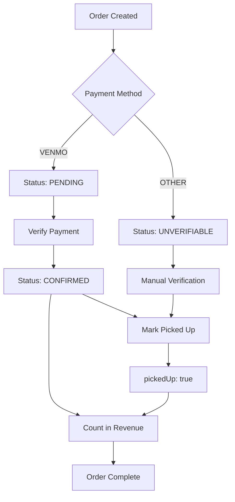

## Overview

Orders represent customer purchases from your fundraiser. Each order contains items, payment information, buyer details, and pickup status. As a seller, you'll verify payments and mark orders as picked up.

## Viewing Orders

Access orders from your fundraiser page at `/seller/fundraiser/:fundraiserId`.

### Order Information

Each order displays:

<ParamField path="id" type="string">
  Unique order identifier (UUID)
</ParamField>

<ParamField path="buyer" type="User">
  Customer who placed the order
  
  ```typescript
  {
    id: string;
    email: string;
    name: string;
  }
  ```
</ParamField>

<ParamField path="items" type="OrderItem[]">
  Array of items and quantities
  
  ```typescript
  {
    quantity: number;
    item: CompleteItem;
  }
  ```
</ParamField>

<ParamField path="paymentMethod" type="PaymentMethod">
  How the customer paid
  
  ```typescript
  enum PaymentMethod {
    VENMO = "VENMO",
    OTHER = "OTHER"
  }
  ```
</ParamField>

<ParamField path="paymentStatus" type="PaymentStatus">
  Current payment verification status
  
  ```typescript
  enum PaymentStatus {
    UNVERIFIABLE = "UNVERIFIABLE",  // OTHER payment method
    PENDING = "PENDING",            // Venmo, awaiting verification
    CONFIRMED = "CONFIRMED"         // Payment verified
  }
  ```
</ParamField>

<ParamField path="pickedUp" type="boolean">
  Whether the customer has collected their order
  
  Default: `false`
</ParamField>

<ParamField path="referral" type="Referral | null">
  Associated referral if order came through referral program
  
  ```typescript
  {
    id: string;
    approved: boolean;
    referrer: User;
  }
  ```
</ParamField>

## Database Schema

```prisma
model Order {
  id            String        @id @default(uuid()) @db.Uuid
  paymentMethod PaymentMethod @map("payment_method")
  paymentStatus PaymentStatus @map("payment_status")
  pickedUp      Boolean       @default(false) @map("picked_up")
  createdAt     DateTime      @default(now()) @map("created_at")
  updatedAt     DateTime      @updatedAt @map("updated_at")

  buyer        User         @relation(fields: [buyerId], references: [id])
  buyerId      String       @map("buyer_id") @db.Uuid
  fundraiser   Fundraiser   @relation(fields: [fundraiserId], references: [id])
  fundraiserId String       @map("fundraiser_id") @db.Uuid
  items        OrderItems[]
  referral     Referral?    @relation(fields: [referralId], references: [id], onDelete: SetNull)
  referralId   String?      @map("referral_id") @db.Uuid
}

model OrderItems {
  quantity Int

  order   Order  @relation(fields: [orderId], references: [id])
  orderId String @map("order_id") @db.Uuid
  item    Item   @relation(fields: [itemId], references: [id])
  itemId  String @map("item_id") @db.Uuid

  @@id([orderId, itemId])
}

enum PaymentMethod {
  VENMO
  OTHER
}

enum PaymentStatus {
  UNVERIFIABLE
  PENDING
  CONFIRMED
}
```

## Payment Status Workflow

<Steps>
  <Step title="Order Created">
    When a buyer creates an order, initial `paymentStatus` is set based on `paymentMethod`:
    
    - **VENMO**: Status is `PENDING` (can be verified)
    - **OTHER**: Status is `UNVERIFIABLE` (manual verification required)
    
    ```typescript
    paymentStatus: orderBody.payment_method === "VENMO" 
      ? "PENDING" 
      : "UNVERIFIABLE"
    ```
  </Step>
  
  <Step title="Verify Payment">
    For Venmo payments, check your Venmo account and confirm receipt:
    
    ```typescript
    PUT /order/:orderId/confirm-payment
    
    Response: {
      message: string;
      data: Order;
    }
    ```
    
    This sets `paymentStatus: "CONFIRMED"`.
  </Step>
  
  <Step title="Mark as Picked Up">
    When the customer collects their order at a pickup event:
    
    ```typescript
    PUT /order/:orderId/pickup
    
    Response: {
      message: string;
      data: Order;
    }
    ```
    
    This sets `pickedUp: true`.
  </Step>
</Steps>

<Info>
  Orders with `paymentStatus: "CONFIRMED"` OR `pickedUp: true` are counted in revenue analytics. Pending orders are tracked separately.
</Info>

## Verifying Payments

### Venmo Payments

<Steps>
  <Step title="Check Venmo Account">
    Log in to Venmo and verify you received payment for the order total.
  </Step>
  
  <Step title="Match Order Details">
    Confirm the payment amount matches the order total:
    
    ```typescript
    // Calculate order total
    const total = order.items.reduce(
      (sum, orderItem) => 
        sum.plus(
          new Decimal(orderItem.item.price.toString())
            .times(orderItem.quantity)
        ),
      new Decimal(0)
    );
    ```
  </Step>
  
  <Step title="Confirm Payment">
    Use the confirm payment endpoint to update status to `CONFIRMED`.
  </Step>
</Steps>

### Other Payment Methods

For `paymentMethod: "OTHER"`:

1. Coordinate with the buyer directly
2. Accept payment through agreed method (cash, check, etc.)
3. Mark order as picked up when payment is received and items are collected

<Warning>
  Orders with `paymentStatus: "UNVERIFIABLE"` cannot be confirmed through the API. They rely on `pickedUp: true` to be counted in revenue.
</Warning>

## Marking Orders as Picked Up

When customers collect their orders:

```typescript
PUT /order/:orderId/pickup

// Updates:
// - pickedUp: true
// - Analytics cache (orders_picked_up count)
// - Revenue if payment wasn't previously confirmed
```

### Analytics Impact

Marking an order as picked up:

✅ **Increments:**
- `orders_picked_up` count

✅ **Updates revenue IF:**
- Previous `paymentStatus` was NOT `"CONFIRMED"`
- Adds order total to `total_revenue`
- Decrements `pending_orders`
- Recalculates `profit` (revenue × 20%)

❌ **Does NOT update revenue IF:**
- Previous `paymentStatus` was `"CONFIRMED"`
- Revenue was already counted when payment was confirmed

```typescript
// From fundraiser.services.ts
if (paymentStatus !== "CONFIRMED") {
  analytics.pending_orders--;
  analytics.total_revenue += orderTotal;
  analytics.profit = 
    Math.round(analytics.total_revenue * PROFIT_MARGIN * 100) / 100;
}
```

## Filtering and Searching Orders

The orders table supports filtering by:

- **Payment Status**: `UNVERIFIABLE`, `PENDING`, `CONFIRMED`
- **Pickup Status**: Picked up vs. not picked up
- **Referral**: Orders with referral attribution
- **Buyer Name**: Search by customer name

## Exporting Order Data

Export orders to CSV for external tracking:

1. Click "Export" on the orders table
2. Download CSV with order details
3. Includes: buyer info, items, quantities, payment status, pickup status

## Creating Manual Orders

Create orders on behalf of customers:

```typescript
POST /order

Body: CreateOrderBody {
  fundraiserId: string;
  items: {
    itemId: string;
    quantity: number;
  }[];
  payment_method: "VENMO" | "OTHER";
  referralId?: string;
}
```

<Note>
  Manual orders follow the same payment status workflow as regular orders. The buyer is set to the currently authenticated user.
</Note>

## Order Lifecycle



## API Reference

### Get Order

```typescript
GET /order/:orderId

Response: {
  message: string;
  data: CompleteOrder;
}
```

### Get Fundraiser Orders

```typescript
GET /fundraiser/:fundraiserId/orders

Response: {
  message: string;
  data: CompleteOrder[];  // Ordered by createdAt DESC
}
```

### Create Order

```typescript
POST /order

Body: CreateOrderBody

Response: {
  message: string;
  data: CompleteOrder;
}
```

### Confirm Payment

```typescript
PUT /order/:orderId/confirm-payment

Response: {
  message: string;
  data: CompleteOrder;
}
```

### Mark as Picked Up

```typescript
PUT /order/:orderId/pickup

Response: {
  message: string;
  data: CompleteOrder;
}
```

### Calculate Order Total

```typescript
GET /order/:orderId/total

Response: {
  message: string;
  data: Decimal;  // Total amount
}
```

## TypeScript Types

```typescript
// From common/schemas/order.ts
export const BasicOrderSchema = z.object({
  id: z.string().uuid(),
  paymentMethod: z.enum(["VENMO", "OTHER"]),
  paymentStatus: z.enum(["UNVERIFIABLE", "PENDING", "CONFIRMED"]),
  pickedUp: z.boolean(),
  createdAt: z.coerce.date(),
  updatedAt: z.coerce.date(),
  buyer: UserSchema,
  fundraiser: BasicFundraiserSchema,
  referral: ReferralSchema.nullish(),
});

export const CompleteOrderSchema = BasicOrderSchema.extend({
  items: z.array(
    z.object({
      quantity: z.number().int().positive(),
      item: CompleteItemSchema,
    })
  ),
});

export const CreateOrderBody = z.object({
  fundraiserId: z.string().uuid(),
  items: z
    .array(
      z.object({
        itemId: z.string().uuid(),
        quantity: z.number().int().positive(),
      })
    )
    .min(1),
  payment_method: z.enum(["VENMO", "OTHER"]),
  referralId: z.string().uuid().optional(),
});
```

## Best Practices

<CardGroup cols={2}>
  <Card title="Verify Quickly" icon="clock">
    Check Venmo regularly and confirm payments promptly to keep customers informed.
  </Card>
  
  <Card title="Clear Communication" icon="message">
    Contact buyers if there are payment discrepancies before marking as picked up.
  </Card>
  
  <Card title="Organized Pickup" icon="clipboard-check">
    Sort orders by buyer name or pickup time to streamline the pickup process.
  </Card>
  
  <Card title="Track Analytics" icon="chart-line">
    Monitor revenue and pickup rates to understand fundraiser performance.
  </Card>
</CardGroup>

## Common Issues

<AccordionGroup>
  <Accordion title="Order not showing in revenue">
    Revenue only counts orders that are:
    - `paymentStatus: "CONFIRMED"`, OR
    - `pickedUp: true`
    
    Pending orders appear in `pending_orders` count instead.
  </Accordion>
  
  <Accordion title="Can't confirm payment for OTHER method">
    Orders with `paymentMethod: "OTHER"` have `paymentStatus: "UNVERIFIABLE"` and cannot be confirmed through the API. Mark them as picked up instead.
  </Accordion>
  
  <Accordion title="Revenue counted twice">
    The system prevents double-counting. If payment is confirmed first, marking as picked up won't add revenue again.
  </Accordion>
</AccordionGroup>

## Next Steps

<CardGroup cols={2}>
  <Card title="Referral Program" icon="user-group" href="/seller/referral-program">
    Track referral attribution for orders
  </Card>
  
  <Card title="Organization Setup" icon="building" href="/seller/organization-setup">
    Manage your organization settings
  </Card>
</CardGroup>